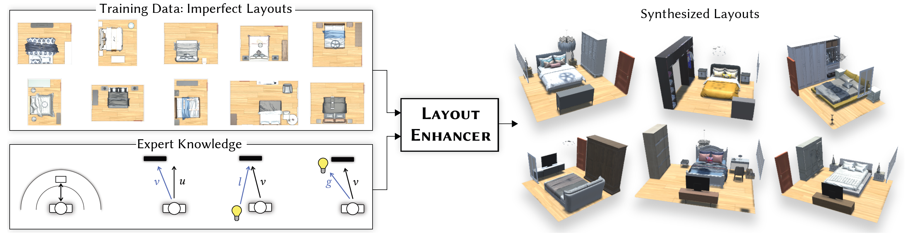

# LayoutEnhancer: Generating Good Indoor Layouts from Imperfect Data



Initial code release for the [LayoutEnhancer paper](https://arxiv.org/abs/TBD), code and scripts for dataset preprocessing, training and layout synthesis.

## Setup
The simplest way to set up the project is to create a new Anaconda environment using the provided `environment.yaml` file:
```
conda create -f environment.yaml
conda activate LayoutEnhancer
```
Alternatively, we also provide a `requirements.txt` file that can be used to install the required packages in an existing environment using pip:
```
pip install -r requirements.txt
```
Our code was tested using Python version 3.7.11. Other versions may work as well, but we cannot give any guarantees.

## Dataset
We use the [3DFRONT](https://tianchi.aliyun.com/specials/promotion/alibaba-3d-scene-dataset) dataset in all our examples. Please follow the instructions on the [website](https://tianchi.aliyun.com/specials/promotion/alibaba-3d-scene-dataset) if you wish to download it.

## Preprocessing
Preproccesing consists of two steps. The first step extracts the most important information from the 3DFRONT dataset. The second step converts the rooms from the extracted data into the sequences that are used for training.

1. The following script extracts the relevant data from the 3DFRONT dataset. It is necessary to provide paths to both the house and 3d-model data:
```
python preprocess_3dfront.py PATH_3DFRONT_HOUSES PATH_3DFRONT_MODELS
```
By default, the processed data is saved in `data/3dfront/`, but a different path can be specified with the `--path_3dfront_data` argument. Different room types (bedrooms, livingrooms, diningrooms, libraries) can be specified with the `--room_type` argument. Since the creation of some of the dictionaries that are used regardless of room type can take a long time, these files will only be created if they don't exist in the 3dfront_data directory. To force the creation of these dictionaries even if they exist already, the `--create_dicts` argument can be used.

2. The following script converts the extracted room information into the sequences that are used as the training data:
```
python convert_rooms_to_sequences.py PATH_TO_CONFIG
```
This command accepts multiple config files as input. Example configs are provided in the `config/` directory, with the `config_reference.yaml` file providing a description of each config parameter. For this step, only the `general` and `paths` parameter categories are relevant. The optional argument `--num_room_plots` can be used to display 2d-plots of the specified number of rooms to check if the conversion was successful.

If you also want provide binary room masks for the pre-processed data, you can instead use
```
python convert_rooms_to_sequences_with_masks.py PATH_TO_CONFIG PATH_3DFRONT_MASKS
```
The `PATH_3DFRONT_MASKS` directory should contain a folder for each room with the name `HOUSENAME_ROOMNAME` which contain a binary mask (white floor, black background) with the filename `room_mask.png` in 256x256 resolution. The pre-processing script of [ATISS](https://github.com/nv-tlabs/atiss) can create such data for the 3DFRONT dataset.

## Training
To train a model, use:
```
python train_network.py PATH_TO_CONFIG
```
This command also accepts multiple config files as input to train several models in succession. In addition to the `general` and `paths` parameter categories, the `network` parameters are also important for this step. To include the room masks during training, the `use_room_masks` parameter must be set to True.

## Evaluation
The following script can be used to evaluate a trained model by synthesizing a large number of layouts and computing the ergonomic score of the created layouts:
```
python create_and_evaluate_scenes.py PATH_TO_CONFIG
```
Again multiple config files can be provided to evaluate multiple models. The new layouts are created without collision-detection and saved in the `path_output_data/sequence/` directory. Once done, plots of the training, validation and ergonomic scores are displayed. The argument `--no_synthesis` can be used to skip the layout synthesis step and just display the losses if they exist already. The maximum number of layouts that are created in parallel can be set with the `--max_batch_size` argument (defaults to 200), since a larger size requires more GPU memory. Finally, the `--manual_seed` argument can be used to set a manual seed for the random sampling process. Please note that this evaluation script does not support room masks.

## Synthesis
To create new layouts (including collision-detection if enabled), the following script can be used:
```
python scene_synthesis.py PATH_TO_CONFIG
```
Multiple config files can be specified to synthesize new layouts for multiple models. The created layouts are saved as sequences in the `path_output_data/sequence/` directory. The argument `--num_room_plots` can be used to create 2d plots of the specified number of rooms, which are then saved in the `path_output_data/plots/` directory. It is also possible to provide a manual seed for the random sampling using the `--manual_seed` argument.

To create layouts conditioned on existing room data (floor, doors and windows), use
```
python scene_synthesis_with_masks.py PATH_TO_CONFIG
```
This script randomly picks rooms from the validation set as input. This requires the data set to be processed with the corresponding script that includes the room masks and a model that has been trained with room masks enabled.

## Reconstruction
The final script reconstructs a 3d scene from the 2d layouts created in the previous step:
```
python reconstruct_scenes.py PATH_TO_CONFIG
```
This scripts creates 2 outputs for each scene. The first is a json-file saved in the `path_output_data/house/` directory which contains the scene-hierarchy including model-ids and transformations for each object in the scene. The second output is saved in the `path_output_data/room/` directory and contains obj- and mtl-files of the floor and walls of the room. If room masks were used to create the scenes, the `--with_floors` argument can be used to export the floor mesh of the corresponding validation set room instead of creating a default rectangular floor. Unfortunately we cannot provide a rendering framework for the scenes at this time. 

**If you find our work useful, please consider citing us:**

```
@misc{leimer2022layoutenhancer,
      title={LayoutEnhancer: Generating Good Indoor Layouts from Imperfect Data}, 
      author={Kurt Leimer and Paul Guerrero and Tomer Weiss and Przemyslaw Musialski},
      year={2022},
      eprint={TBD},
      archivePrefix={arXiv},
      primaryClass={cs.GR}
}
```
